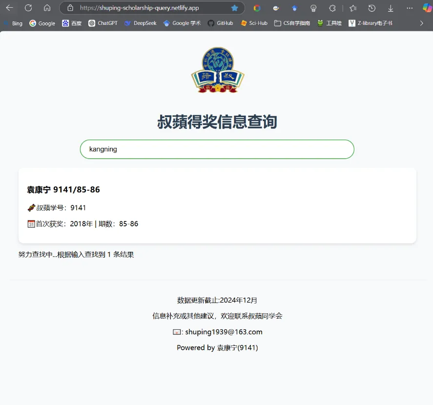

# 叔蘋奖学金得奖信息查询系统

 

## 项目概述
- [项目源于KangningYuan，详情请点击了解](https://github.com/kangningyuan/scholarship-query)

这是fork自Kangning的GithubPage的一个项目。

为了便于中国大陆尤其是处于移动运营商网络覆盖下的用户访问，我们将当前的Github-Page页使用托管部署，经过测试能够覆盖绝大部分用户。

- [直连访问github.io](https://shuping1939.github.io/scholarship-query/)
- [托管访问netlify.app](https://shuping-scholarship-query.netlify.app/)

本查询系统支持通过学号、姓名、拼音及学校等多条件实时检索叔蘋同学的获奖信息。数据采用分片加载机制，具备响应式设计和友好的移动端体验。

## 技术栈

## 联系 📞
> 🙇‍♂️: 袁康宁 -- 上海叔蘋同学会IT组  
> 💻：[KangningYuan](https://github.com/kangningyuan)  
> 📧: yuankangning@outlook.com
